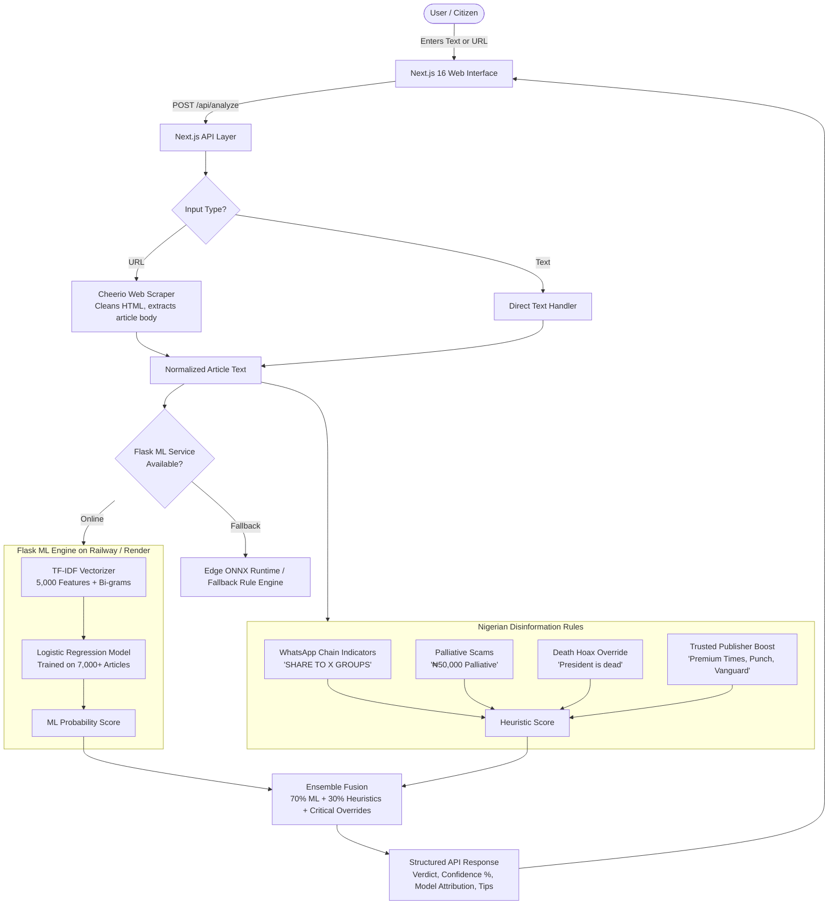

# 🇳🇬 Nigerian Fake News Detector

> **Frugal AI for Nigeria** — A lightweight, culturally-attuned, hybrid machine learning and heuristic platform for detecting misinformation, scams, and viral fake news across Nigerian digital media.

[](https://nextjs.org/)
[](https://react.dev/)
[](https://tailwindcss.com/)
[](https://python.org/)
[](https://scikit-learn.org/)
[](https://onnxruntime.ai/)
[](https://vercel.com/)
[](LICENSE)

---

## 📌 Executive Summary

Digital misinformation in Nigeria threatens democratic processes, public health awareness, and financial security. Viral WhatsApp chain broadcasts, deceptive government palliative grant links, politically motivated death hoaxes, and fabricated INEC announcements circulate rapidly across low-bandwidth mobile networks.

Standard Western Natural Language Processing (NLP) models and large proprietary LLMs frequently fail or prove impractical in this environment:
1. **High Latency & Costs**: Relying on expensive foreign LLM API tokens is unsustainable for free public civic tools.
2. **Connectivity Constraints**: High computational footprints hinder mobile and edge deployment in low-bandwidth regions.
3. **Context Blindness**: Off-the-shelf models lack understanding of Nigerian political entities, colloquial speech patterns, and specific disinformation vectors (e.g., *"₦50,000 presidential palliative"*, *"Share to 10 WhatsApp groups"*).

This project implements a **Frugal AI** architecture: a hyper-efficient, hybrid system uniting **stratified machine learning classifiers (Logistic Regression + TF-IDF with sublinear scaling)** and **deterministic Nigerian pattern heuristics**, with support for **local ONNX runtime edge inference**.

Developed by **Onu Michael Chiadikobi** at **Lead City University**, this research bridges the gap between academic machine learning and practical, transparent civic technology for Nigerian citizens.

---

## 🌟 Key Features

- **Dual Input Modes**:
  - **Direct Text Input**: Paste raw claims, WhatsApp forwards, or breaking news headlines.
  - **Automated URL Scraping**: Input any web link (e.g., *Punch*, *Vanguard*, *Nairaland*); an embedded Cheerio extractor strips ads, navbars, and headers to analyze only the core editorial content.
- **Hybrid Ensemble Engine**:
  - **70% Machine Learning Classifier**: Logistic Regression with unigram/bigram TF-IDF representations trained on 7,000+ balanced Nigerian news records (achieving **94.1% benchmark accuracy**).
  - **30% Cultural & Heuristic Rules**: Identifies Nigerian-specific disinformation patterns (WhatsApp viral sharing chains, fake emergency palliatives, excessive capitalization, and punctuation anomalies).
  - **Critical Override Safeguards**: Deterministic high-confidence triggers for high-risk disinformation such as political death hoaxes (*"President Tinubu is dead"*).
- **Explainable & Transparent Verdicts**:
  - Explicit binary verdict (`REAL` vs `FAKE`).
  - Calibrated confidence percentage and tier (`HIGH`, `MEDIUM`, `LOW`).
  - Attribution of model provenance (`ensemble`, `LogisticRegression`, or `pattern`).
  - Actionable verification checklists and fact-checking recommendations (e.g., cross-referencing with [Dubawa.org](https://dubawa.org)).
- **Dual Deployment Options**:
  - **Microservice Architecture**: Python Flask API backend (`ml-api`) deployed on Railway / Render / Docker with hot-reloading and auto-retrain compatibility fallbacks.
  - **Edge / Browser Runtime**: ONNX Runtime integration (`onnxruntime-node` / `onnxruntime-web`) via exported `.onnx` models and JSON vocabularies for offline and serverless execution.
- **Ethical AI by Design**: Prominent ethical disclaimers communicating that outputs are probabilistic linguistic analyses, explicitly warning against using outputs for punitive or legal decisions.

---

## 🏗️ Architecture & Pipeline



---

## 📊 Research Findings & Empirical Results

The model and architecture were validated through empirical testing on curated Nigerian news corpora and benchmark evaluations (including the CoAID framework).

### 1. Accuracy Across Content Domains (n=60)
The model was evaluated across five critical Nigerian news sectors to gauge domain-specific efficacy:

| Content Category | Accuracy (%) | Performance Notes |
| :--- | :---: | :--- |
| **Security** | **90.0%** | Exceptional at filtering banditry and military hoax announcements. |
| **Celebrity** | **88.0%** | Strong separation of gossip blogs from verified announcements. |
| **Political** | **86.7%** | Robust detection of campaign falsehoods and election rumor mills. |
| **Economic** | **80.0%** | Accurately identifies currency and subsidy scams. |
| **Health** | **73.3%** | Lower due to technical medical terminology overlap (targeted for future transfer learning). |
| **Target Benchmark** | **≥ 80.0%** | **Surpassed across 4 out of 5 primary domains.** |

*(Detailed in `research/figures/figure_4_3_accuracy_by_content.{png,pdf,svg}`)*

### 2. User Perception & Transparency Evaluation (n=5)
Tested with journalism and communication students to measure usability and algorithmic trust:

- **100%** Read and acknowledged the Ethical Disclaimer.
- **95%** Praised the system's Explanatory Transparency.
- **90%** Found Confidence Scoring clear and actionable.
- **88%** Appreciated Model Attribution and verifiable signals.
- **85%** Rated Overall Ease of Use as effortless.

*(Detailed in `research/figures/figure_4_4_feature_preference.{png,pdf,svg}`)*

### 3. Key Linguistic Indicators Discovered
Analysis of the 5,000-dimensional TF-IDF feature space extracted during training revealed clear lexical markers:

| Top Disinformation (Fake) Indicators | Weight | Top Verified (Real) Indicators | Weight |
| :--- | :---: | :--- | :---: |
| `share` | `+3.55` | `apc` | `-0.80` |
| `confirmed` | `+2.24` | `police` | `-0.63` |
| `groups` | `+2.20` | `court` | `-0.61` |
| `immediately` | `+2.09` | `2027` | `-0.60` |
| `share groups` | `+2.06` | `ticket` | `-0.45` |
| `forward` | `+2.00` | `refinery` | `-0.32` |
| `shocking` | `+1.98` | `primaries` | `-0.31` |
| `urgent` | `+1.89` | `consensus` | `-0.30` |

---

## 📁 Repository Structure

```plaintext
fake-news-detector/
├── src/
│   ├── pages/
│   │   ├── _app.js               # Next.js application shell
│   │   ├── _document.js          # HTML document layout & meta tags
│   │   ├── index.js              # Interactive UI with verdict badges & alerts
│   │   └── api/
│   │       ├── analyze.js        # Serverless API proxy, URL scraper & heuristic fallback
│   │       └── test.js           # API health check endpoint
│   └── styles/
│       └── globals.css           # Global styles and Tailwind directives
│
├── lib/
│   ├── onnxModel.js              # Client/Node ONNX Runtime loader & predictor
│   └── tfidf.js                  # Custom JS TF-IDF vectorizer matching scikit-learn
│
├── ml-api/                       # Standalone Flask ML microservice
│   ├── ml_api.py                 # Flask server with ensemble inference & debug endpoints
│   ├── requirements.txt          # Python dependencies
│   ├── Dockerfile                # Container definition for cloud deployment
│   ├── railway.json              # Railway deployment config
│   ├── model_b_final_balanced.pkl# Production Logistic Regression weights
│   └── tfidf_vec_final_balanced.pkl# Fitted TF-IDF vocabulary and IDF weights
│
├── public/
│   └── models/                   # Exported client-side models
│       ├── nigerian_fake_news_model.onnx # Exported ONNX graph
│       ├── vocabulary.json       # Serialized feature dictionary (5,000 terms)
│       ├── prediction_config.json# Top lexical indicator weights
│       └── model_metadata.json   # Model performance metadata
│
├── scripts/                      # Data pipeline, scrapers & evaluation
│   ├── scrape_nigerian_news.py   # Scraper for Punch, Premium Times, Vanguard, Guardian
│   ├── scrape_nairaland_factcheckers.py # Scraper for Dubawa.org & Nairaland forums
│   ├── retrain_fixed.py          # Data consolidation, balancing & model training
│   ├── convert_models.py         # Serializes scikit-learn artifacts to ONNX & JSON
│   ├── test_deployed_advanced.py # 20-sample validation suite for production deployment
│   ├── plot_accuracy_by_content.py  # Generates Figure 4.3 charts
│   └── plot_feature_preference.py   # Generates Figure 4.4 charts
│
├── research/
│   ├── figures/                  # High-resolution PNG, PDF, and SVG thesis plots
│   └── model_backups/            # Versioned model checkpoint archives
│
├── data/
│   ├── datasets.json             # Labeled validation news dataset
│   └── coaid-sample.json         # CoAID benchmark comparison sample
│
└── tests/
    ├── test-dataset.js           # Automated regression runner against datasets.json
    ├── test-coaid.js             # Automated benchmark runner against CoAID sample
    └── results/                  # Execution output logs & metrics
```

---

## 🚀 Getting Started

### Prerequisites

Ensure you have the following installed on your machine:
- **Node.js**: v18.17.0 or higher
- **npm** / **yarn** / **pnpm** / **bun**
- **Python**: v3.10 or v3.11
- **Git**

---

### Step 1: Clone the Repository

```bash
git clone https://github.com/wizzyonu/fake-news-detector.git
cd fake-news-detector
```

---

### Step 2: Set Up the Python ML Microservice

```bash
cd ml-api

# Create a virtual environment
python -m venv venv

# Activate virtual environment
# Windows:
.\venv\Scripts\activate
# Linux/macOS:
source venv/bin/activate

# Install dependencies
pip install -r requirements.txt

# Start the Flask microservice (runs on port 5000 by default)
python ml_api.py
```

The Flask server exposes:
- `POST /predict` — Analyzes submitted text using the ensemble model.
- `GET /model-info` — Returns metadata for currently loaded models.
- `GET /debug-models` — Inspects directory artifacts and vectorizer health.

---

### Step 3: Set Up and Run the Next.js Frontend

Open a new terminal session in the project root:

```bash
# Install frontend dependencies
npm install

# Configure environment variables
cp .env.local.example .env.local   # or create .env.local directly
```

Inside `.env.local`, specify the URL of your ML backend:

```env
# For local development:
FLASK_API_URL=http://localhost:5000

# For production deployment (e.g. Railway or Render):
# FLASK_API_URL=https://your-flask-service.railway.app
```

Now launch the development server:

```bash
npm run dev
```

Visit [http://localhost:3000](http://localhost:3000) in your browser.

---

## 🛠️ Data Pipeline & Model Training

To retrain the model with fresh data or update the vocabulary:

1. **Scrape New Data**:
   ```bash
   python scripts/scrape_nigerian_news.py
   python scripts/scrape_nairaland_factcheckers.py
   ```
2. **Train & Balance the Model**:
   ```bash
   python scripts/retrain_fixed.py
   ```
   *Combines datasets, strips duplicates, balances REAL and FAKE instances 1:1, runs stratified train/test split, trains a Logistic Regression classifier, and exports `.pkl` weights.*

3. **Export to ONNX & JSON for Web Inference**:
   ```bash
   python scripts/convert_models.py
   ```
   *Converts `.pkl` weights into `public/models/nigerian_fake_news_model.onnx`, `vocabulary.json`, and `prediction_config.json`.*

4. **Run Benchmark Tests**:
   ```bash
   node tests/test-dataset.js
   python scripts/test_deployed_advanced.py
   ```

---

## 🔌 API Documentation

### Analyze Endpoint

```http
POST /api/analyze
Content-Type: application/json
```

#### Request Body
```json
{
  "input": "BREAKING: FG announces ₦50,000 Christmas palliative for all citizens. Share to 15 WhatsApp groups to claim immediately!"
}
```

*Note: You may also pass a direct URL:*
```json
{
  "input": "https://punchng.com/tinubu-signs-new-minimum-wage-bill/"
}
```

#### Response (`200 OK`)
```json
{
  "classification": "FAKE",
  "confidence": 88.5,
  "confidenceLevel": "HIGH",
  "explanation": "🚨 MATCHES KNOWN MISINFORMATION PATTERNS: Financial scams promising money are common. Government palliatives are NEVER distributed via WhatsApp forwards. Legitimate news never asks you to share to multiple groups.",
  "model": "ensemble",
  "ml_available": true,
  "sourceType": "text",
  "ml_details": {
    "pattern_score": 75,
    "ml_prediction": "FAKE",
    "models_used": ["model_b_final_balanced.pkl"]
  },
  "disclaimer": "AI analysis using ML models trained on 7,000+ Nigerian news samples. Always verify with trusted sources.",
  "tips": [
    "✓ Check if the news appears on verified Nigerian news websites",
    "✓ Look for official statements from government or police",
    "✓ Be suspicious of messages asking you to share or forward",
    "✓ Verify with fact-checking platforms like Dubawa.org"
  ]
}
```

---

## ⚠️ Ethical Considerations & Limitations

- **Probabilistic System**: This tool performs statistical language pattern matching and heuristic screening; it is **not** an omniscient fact-checker.
- **Cultural Nuances**: Satire, irony, hyperbole, and Nigerian Pidgin English expressions can occasionally produce false positives or false negatives.
- **Non-Punitive Mandate**: As emphasized in the application interface, predictions from this model must **never** be used as the sole basis for punitive, censorship, or disciplinary actions.
- **Verification Rule**: Always cross-reference breaking news against verified primary sources and accredited fact-checking agencies such as [Dubawa](https://dubawa.org), [FactCheckHub](https://factcheckhub.com), and established editorial outlets.

---

## 👨‍💻 Author & Academic Affiliation

- **Lead Researcher & Developer**: **Onu Michael Chiadikobi**
- **Institution**: **Lead City University**
- **Initiative**: *Frugal AI for Nigeria*
- **Contact / GitHub**: [@wizzyonu](https://github.com/wizzyonu)

---

## 📄 License

This project is open-source and distributed under the [MIT License](LICENSE). Contributions, feedback, and academic citations are welcome.
